# Indo - German - Testing

:arrow_left: [Return to the README](README.md)

## Table of Contents
- [Testing](#testing)
  - [User Story Testing](<#user-story-testing>)
  - [Manual Testing Backend](#manual-testing-backend)
  - [Manual Testing of Features Frontend](#manual-testing-of-features-frontend)
- [Validation - Backend](#validation-backend)
- [Validation - Frontend](#validation-frontend)
- [Performance](#performance)
  - [Google's Lighthouse Performance](#googles-lighthouse-performance)

## Testing

### User Story Testing
BDD, or Behaviour Driven Development, is the process used to test user stories in a non-technical way, allowing anyone to test the acceptance criteria of user story.

User Story | Acceptance Criteria | Associated Feature | Test Result 
--- | --- | --- | :---: 
As a site user  I can capability   I can easily understand the purpose and main features of the website. | **Acceptance Criteria 1**  Given that a new user visit the site  When they are on the landing page Then they should see what the purpose of the site at the first glance. | Landing page image and text | :white_check_mark: 
As a site user  I can see well written instructions on how to get started  so that I can easily get information about how to start to use the web application. | **Acceptance Criteria 1**  Given that a new user visit the site  When they are on the landing page Then they can see the Sign In / Sign Up buttons.  **Acceptance Criteria 2**  Given that a new user visit the site   Then they see the clear discription about the website on landing page. | **1.** 'new here? Join us !' and 'member? Sign In and start!' buttons on landing page | :white_check_mark:
As a site user  I can see sign up and sign in link to the site   so that I can easily register or sing in to access the functionality of website.| **Acceptance Criteria**  Given that a new user visit the site  When they are on the landing page Then they can see the Sign In / Sign Up links in navbar.  **Acceptance Criteria 2**   Given that a new user/returning user visit the site When they visit on the landing page  Then they are guided to register if they are not a member or sign in if they are registered already. | **1.** Nav links for Sign In/Sign Up   **2.** 'new here? Sign Up' and 'member? Sign In' buttons on landing page | :white_check_mark: 
As a site user  I can sign up and sign in to the site   so that I can access the functionality of website.| **Acceptance Criteria 1**  Given that a new user visit the site  When they click on Sign Up Nav link Then they are redirected to Sign Up page.  **Acceptance Criteria 2**   Given that a new user is on Sign Up page When they entered their username and password  Then they are prompted to Sign In.   **Acceptance Criteria 3**   Given that a new user is on Sign In page When they entered their username and password  Then they can see it reflect on the navbar with new nav items| **1.**  Sign In page  **2.** Sign Up page | :white_check_mark: 
As a site user  I can easily sign out   so that I can have more security on my account.| **Acceptance Criteria 1**  Given that a new user is on any page  When they they are logged in Then they can see Sign out link in navbar.  **Acceptance Criteria 2**   Given that a user is on any page When they clicked on Sign Out link  Then they are redirected to the landing page.| Sign out link on navbar | :white_check_mark: 
As a site user  I can maintain my logged-in status until I choose to log out  so that my user experience is not compromised.| **Acceptance Criteria**  Given that a new user is signed in When they don't even visit the website Then they still remained signed in 24h.| Access token | :white_check_mark: 
As a site user   I can see a navigation bar on every page  so that I can easily return to pages I wish to visit.| **Acceptance Criteria 1** Given that new/returning user visits the site When they are on any web-page Then they can see navigation items on screen clearly labelled with their function **Acceptance Criteria 2** Given that new/returning user visit the site When they are a selected web-page Then they can see on which page are they on  **Acceptance Criteria 3** Given that user visits the site When they sign in Then they can see a sign out link along with all the features that the site offers | **1.** NavBar features   **2.** Color changed active Nav link   **3** Nav bar with different nav links | :white_check_mark: 
As a site user   I can infinitely scroll down to see more posts and also to see more comments   I can consistently look at more posts/comments without having to click any extra links to view more. | **Acceptance Criteria 1** Given that a new/returning/registered user visits the website When they are on Homepage Then they can see and read all the posts **Acceptance Criteria 2** Given that the user is on posts section of the Homepage When they scroll through all the posts Then they can continue scrolling through all the content without having to go to a new page | Post list page(Home Nav link) | :white_check_mark: 
As a site user   I can navigate through pages quickly   so that I can view content smoothly without the pages being refreshed.| **Acceptance Criteria** Given that user is on navigation menu of the site When they click on different nav item Then they can see that page doesn't reload each time when they clicked on nav item | Refresh function | :white_check_mark: 
As a site user   I can create posts   so that I can share my post with others.| **Acceptance Criteria 1** Given that a signed in user visits the app When they navigate to the create post section Then they are redirected to a create post form page, filling have the choice to create a new post.  **Acceptance Criteria 2** Given that a user is signed in When the save the post Then it is available for others to read| **1** Post Creation form(Add Post link)  **2** Post section on home page | :white_check_mark: 
As a site user  I can edit/delete my posts    so that I can make changes to existing post information or remove my content.| **Acceptance Criteria 1** Given that a signed-in user visits the app When they navigate to their own post Then they can see a edit/delete option with which they can update/delete their post **Acceptance Criteria 2** Given that a user is signed in When they select delete option Then they get a feedback message **Acceptance Criteria 3**   Given that signed-in user visits the app When they click on the edit option  Then they can see the post in an editable format and an update button | **1** Edit icon on creator's post in dropdown menu  **2** Post edit page | :white_check_mark: 
As a site user  I can view all the posts on the User's Feed page   so that I can see all the posts posted by the people whom I follow.| **Acceptance Criteria 1** Given that a signed in user visits the app When they visit the User's Feed page Then posts on top of the people whom they follow **Acceptance Criteria 2** Given that a user is signed in When they click on the post title Then they are redirected to the respective detail page | **1** Feed Nav link  **2** Post detail page | :white_check_mark: 
As a site user  I can view and read the detailed post page of all of the site users   so that I can view the comments made by different users.| **Acceptance Criteria 1** Given that a signed-in user visits the app When they are at any selected Post details page Then they can see the comments the post received and also a section where they can enter their comments for the post **Acceptance Criteria 2** Given that a user is signed in When they are at their Post details page of which they are the author Then they can see the update and delete options | **1** Comment box  **2** Dropdown menu with edit/delete icon | :white_check_mark: 
As a site user  I can search for posts or users in a search box   so that I can quickly find specific posts or users that I am wanting to look for.| **Acceptance Criteria** they use the search bar on the website they can access all relevant information to my search term | Search bar | :white_check_mark: 
As a site user  I can read comments on a post   so that I can read what others think about the post and read the discussion happening.| **Acceptance Criteria 1**  Given that a signed-in user visits the app When they are at Post details page Then they can see and read all the Comments of different users on that post **Acceptance Criteria 2** Given that a user is signed in When they are at Post details page Then they can see number of comments the post received | **1.** Comment section under the post(Post detail page)  **2.**  Comment icon | :white_check_mark:
As a site user  I can post a comment on a post  so that I can contribute discussion to a post or share my thoughts about a post.| **Acceptance Criteria 1**  Given that a signed-in user visits the app When they are at Post details page Then they have the choice to create a new Comments **Acceptance Criteria 2** Given that a user is signed in When they are at Post details page and make a comment Then they see the comment getting saved below the same Post with their name and date of creation | **1.** Comment create section under the post(Post detail page)  **2.**  Comment button to post the comment | :white_check_mark:
As a site user  I can edit/delete my comments  so that I have the possibility to remove or add more details to my existing comments.| **Acceptance Criteria 1**  Given that a signed-in user When they click on the edit option Then they can see the Comments in an editable format and an update button **Acceptance Criteria 2** Given that a user is signed in When they navigate to their own Comments Then they can see an edit/delete option. | **1.** Comment Edit form  **2.**  Dropdown menu with edit/delete icon | :white_check_mark:
As a site user  I can see the post that have received most number of likes   so that I can assess which are the best ones.| **Acceptance Criteria** Given that a signed-in user When  they are at Homepage Then they can see the posts with number of likes on it | Post section | :white_check_mark:
As a site user  I can like a post   so that I can share my appreciation for the post and show the author that their post is great.| **Acceptance Criteria** Given that a signed-in user When they are on any post Then they can click on the like button and can like it | Like Icon on a post | :white_check_mark:
As a site user  I can remove likes on a post   so that I can show that my opinion has changed.| **Acceptance Criteria** Given that a signed-in user When they are on the post which they already liked Then they can click on the like button and can unlike it | Like Icon on a Post | :white_check_mark:
As a site user  I can like/unlike comments   so that I can share my feelings towards a comment.| **Acceptance Criteria** Given that a signed-in user When they navigate to the post comment section Then they can like/unlike any of the comment | Like Icon in Comment section | :white_check_mark:
As a site user  I can view a detailed profile page of users   so that I can see their posts and learn more about the user. I can also see their following count, followers count, etc.| **Acceptance Criteria** Given that a signed-in user  When they click on username of the list of users  Then they can see their full name, followers info, brief bio and their post along with other details | Profile Avatar | :white_check_mark:
As a site user  I can see the most popular profiles   so that I can see who has the most interesting posts | **Acceptance Criteria** Given that a signed-in user  When they navigate to the Home / Feed /Liked page  Then they can see a list of the most popular profiles with the follow button | Popular Profile list  | :white_check_mark:
As a site user  I can update my own profile   so that I can make changes as needed |**Acceptance Criteria** Given that a signed-in user  When they click on edit profile option  Then they can see an option to update their name, brief bio, image and other details | Profile Edit form  | :white_check_mark:

---

### Manual Testing Backend

- Thorough lists of tests have been done on the back end project. These are lists of successful results after vigorous manual testing.
  Testing was done manually by trying each list over and over to ensure success. I have tested each list over and over again to ensure that everything is working perfectly.

1. Profile:

   - Users are able to successfully create an account and their profile, default image, and content are saved in the database.
   - Users are able to view their username, image, content, when their account was created, etc.
   - The post count, following count, and follower count are visible in the user API. When creating new posts, following new users or being followed, the numbers will go up, and will decrease when there are any deletions or unfollows.
   - A List of users are shown in the list view, and a detailed list of users will show with the approrpriate id.
   - User can view other's profile but can edit their own profile.
   - Users are able to be deleted in the back end.
   - All urls are working perfectly. Can view all profiles when visiting `api/profiles/`. Can access specific profiles in detail view when adding specific profile id to url.

   

    
Screenshot of Profile List

    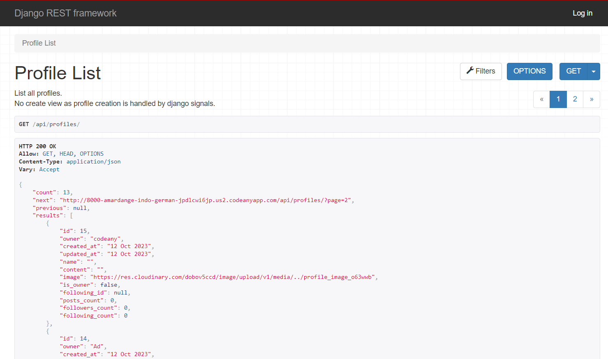
    

2. Post:

   - Users are able to successfully create posts and have the posts attached to the user id.
   - The number of posts tied to a user will increase or decrease if the user posts more or deletes posts.
   - API shows whether the logged-in user is the author of the post or not.
   - The posts successfully show the author, when it was created, when it was updated, the post image, the content, and title.
   - Posts are successfully able to be edited and deleted ONLY by the author of the post.
   - Image validation created in the serializer.py works as images posted by the user must be less than 2 MG, smaller than 4096 px in width and in height.
   - The list of posts appear in the list view page, and a detailed view of posts will appear in the detail view page with the appropriate post id.
   - Posts are successfully able to be searched by typing author, title, and content.
   - Posts are successfully able to be filtered by user feed, user-liked posts, and user posts.
   - Posts are successfully able to be ordered based on number of likes, the number of comments, and when the post like was created at.
   - Posts are able to be liked and unliked, and have the number of likes edited accurately.
   - All urls are working perfectly. Can view all posts when visiting `/posts/`. Can access specific posts in detail view when adding specific post id to url.

   

Screenshot of Posts List 

    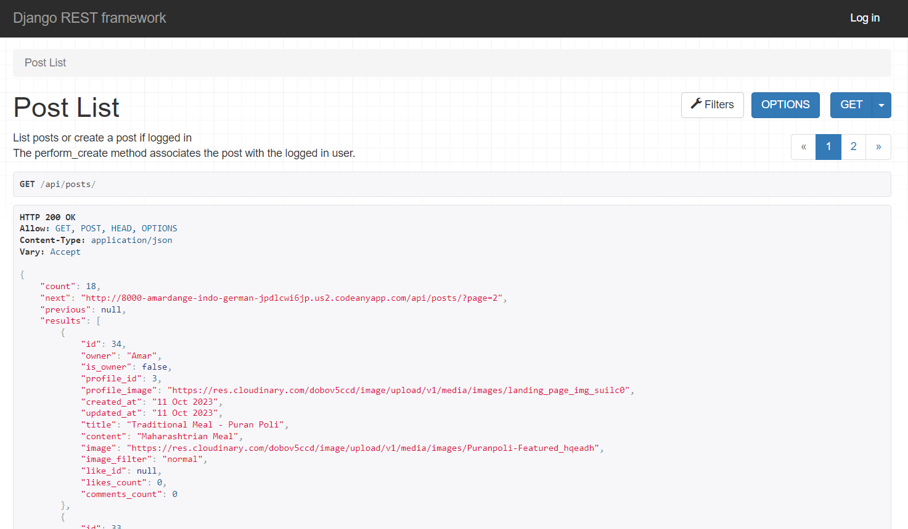
    

3. Comment:

   - Users are able to successfully create comments and have the comments attached to the user id and post id.
   - The number of comments will increase or decrease if the user chooses to delete or remove the comment.
   - API shows whether the logged-in user is the commenter of the comment or not.
   - The comments successfully show the commenter, when it was created, when it was updated, and the content.
   - Comments are successfully able to be edited and deleted ONLY by the commenter of the post.
   - The list of comments appear in the list view page, and a detailed view of comments will appear in the detail view page with the appropriate comment id.
   - Comments associated with a given post are successfully able to be retrieved.
   - Comments are successfully able to be ordered based on number of likes and when the comment like was created at.
   - Comments are able to be liked and unliked, and have the number of likes changed accurately.
   - All urls are working perfectly. Can view all comments when visiting `/comments/`. Can access specific comments in detail view when adding specific comment id to url.

    

Screenshot of Comment List 

     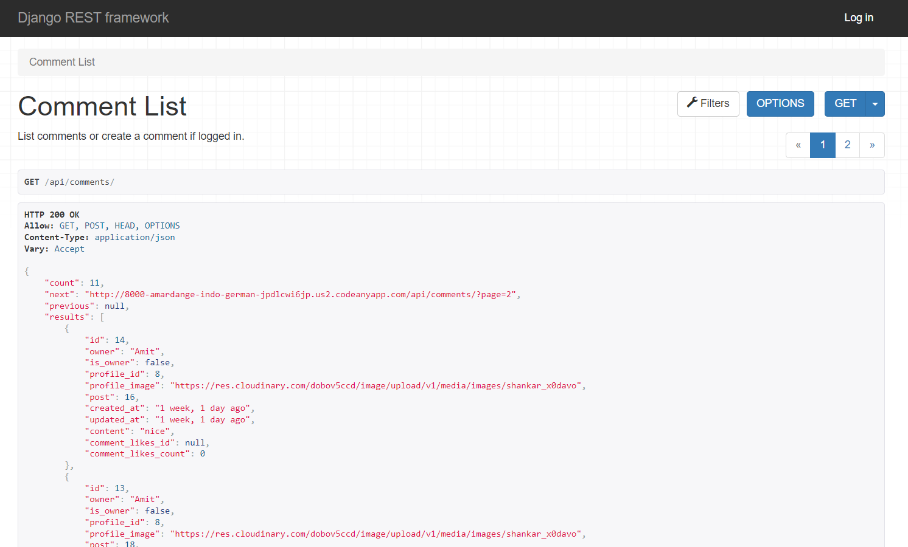
     

4. Follower:

   - Users are successfully able to follow other users. API successfully reads which user is the follower, and which user is being followed.
   - The creation date of the follow is successfully logged with the number of days shown.
   - If a user tries to follow a user again, the API will throw a duplicate validation error.
   - The list view successfully shows a list of all follows.
   - In detail follow view, can see detailed information on the follow.
   - Users are able to successfully unfollow the users that they are following.
   - Users are able to follow themselves in the back end. But in the front-end, conditional rendering will be applied to prevent users from following themselves.
   - All urls are working perfectly. Can view all followers when visiting `/followers/`. Can access specific followers in detail view when adding specific follower id to url.

    

Screenshot of Follower List 

     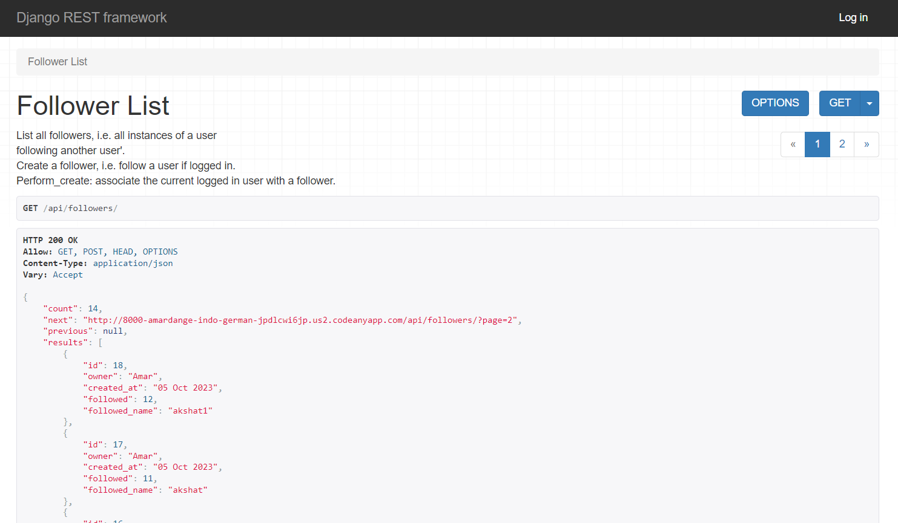
     

5. Post likes:

   - Users are successfully able to like other posts. API successfully registers the post_likes_id to the post.
   - Users are successfully able to unlike the posts that they have liked.
   - Users are not able to like their own posts or else a permission denied error will be thrown.
   - If users try to like a post they have already liked, the API will throw a duplicate validation error.
   - All urls are working perfectly. Can view all post likes when visiting `/post_likes/`. Can access specific post likes in detail view when adding specific post likes id to url.

    

Screenshot of Post Likes List 

     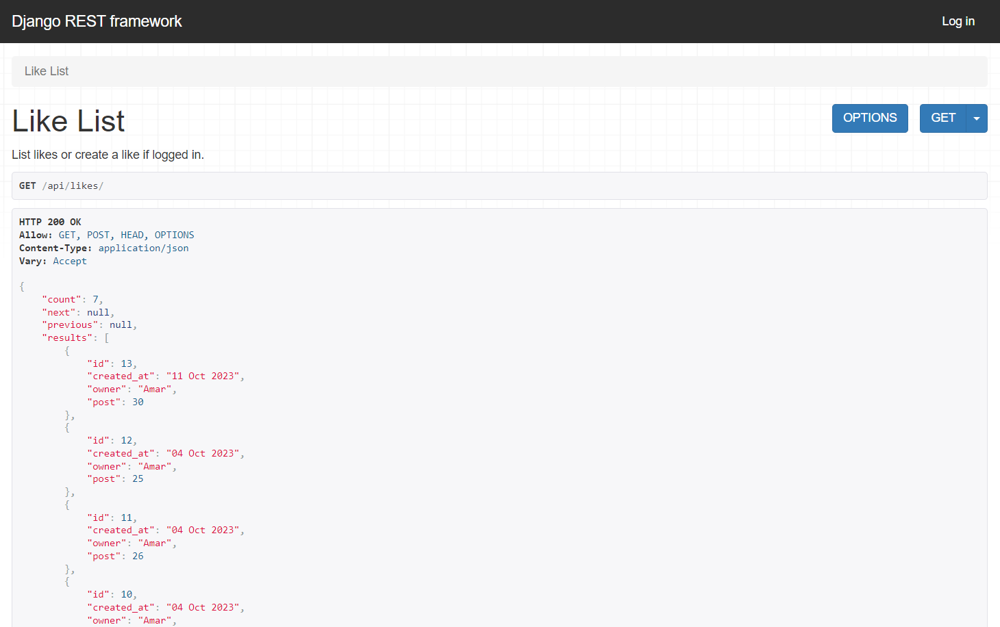
     

6. Comment likes:

   - Users are successfully able to like other comments. API successfully registers the comment_likes_id to the comment.
   - Users are successfully able to unlike the comments that they have liked.
   - Users are not able to like their own comments or else a permission denied error will be thrown.
   - If users try to like a comment they have already liked, the API will throw a duplicate validation error.
   - All urls are working perfectly. Can view all comment likes when visiting `/comment_likes/`. Can access specific comment likes in detail view when adding specific comment_likes_id to url.

    

Screenshot of Comment Likes List 

     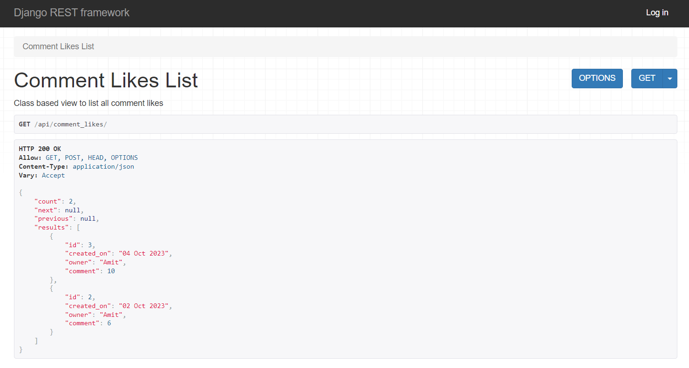
     

7. Authentication:
   - Users are able to create a new account on the back end and the new user details will be saved.
   - In the back end, users are able to successfully login and view their username in the navigation bar.
   - Users are able to log out of the back end successfully.

### Manual Testing of Features
I manually tested all the features of the website making sure to go through them with different browsers and device sizes. I also checked the features of the site against the original user stories and compared them with the acceptance Criteria. 

The aspects considered while testing:
- CRUD functionality for Posts, Comments, Likes, Follows and Profile on both the development and deployed version of the site.
- All Nav links open on the correct page
- Page responsiveness
- Authentication works displaying a different set of options for logged-in users compared to logged-out
- Not found pages display correctly when a non-existent URL when entered

The sections below presents an exhaustive list of manual tests done.

#### LandingPage

**Function Tests:**

| **Expected Feature** | **Result** |
|-------------------------|---------------------|
| When Sign Up Nav Item is clicked, Sign Up page opens| **Pass** |
| When Sign In Nav Item is clicked, Sign In page opens| **Pass** |
| When Sign Up New? button is clicked, Sign Up page opens| **Pass** |
| When Sign In Member? button is clicked, Sign In page opens| **Pass** |
| When Logo is clicked, Landing page first view returns| **Pass** |
| When Footer links are clicked, Respective links open| **Pass** |

**Responsiveness Test:**

| **Expected Feature** | **Result** |
|-------------------------|---------------------|
| When in Inspect mode in Dev Tools is open, Landing Page is responsive| **Pass** |

#### PostsListPage

**Function Tests:**

|  **Expected Feature** | **Result** |
|-------------------------|---------------------|
| On the top position, NavBar Home NavItem changes view| **Pass** |
| On the left panel, one can see categories section| **Pass** |
| On the right panel, one can see PopularProfiles section| **Pass** |
| In the center, one can see posts section | **Pass** |
| Latest post features first | **Pass** |
| Posts section has infinite scroll feature| **Pass** |

**Responsiveness Test:**

|  **Expected Feature** | **Result** |
|-------------------------|---------------------|
| On the large devices and above, three columns are visible with panels ratio 1:2:1| **Pass** |
| On the small devices like mobile and above, one column is visible| **Pass** |
| On the small devices like mobile and above, NavBar toggles to Hamburger menu view| **Pass** |

#### Feed Page

**Function Tests:**

|  **Expected Feature** | **Result** |
|-------------------------|---------------------|
| On the top position, NavBar Feed NavItem changes view  | **Pass** |
| On the left panel, one can see section| **Pass** |
| On the right panel, one can see PopularProfiles section| **Pass** |
| In the center, one can see section enlisting all the posts of the profiles user follows | **Pass** |
| Post section has infinite scroll feature| **Pass** |

**Responsiveness Test:**

|  **Expected Feature** | **Result** |
|-------------------------|---------------------|
| On the large devices and above, three columns are visible with panels ratio 1:2:1| **Pass** |
| On the small devices like mobile and above, one column is visible| **Pass** |
| On the small devices like mobile and above, NavBar toggles to Hamburger menu view| **Pass** |

#### Liked Page

**Function Tests:**

|  **Expected Feature** | **Result** |
|-------------------------|---------------------|
| On the top position, NavBar Liked NavItem changes view  | **Pass** |
| On the left panel, one can see caregory section| **Pass** |
| On the right panel, one can see PopularProfiles section| **Pass** |
| In the center, one can see section enlisting all the posts that user liked | **Pass** |
| Post section has infinite scroll feature| **Pass** |

**Responsiveness Test:**

|  **Expected Feature** | **Result** |
|-------------------------|---------------------|
| On the large devices and above, three columns are visible with panels ratio 1:2:1| **Pass** |
| On the small devices like mobile and above, one column is visible| **Pass** |
| On the small devices like mobile and above, NavBar toggles to Hamburger menu view| **Pass** |

#### Create Post

**Function Tests:**

|  **Expected Feature** | **Result** |
|-------------------------|---------------------|
| When  'Add Post' nav link is clicked, Post create form opens | **Pass** |
| Contains title, content and image fields that users can fill and submit| **Pass** |
| Upon submitting filled form, post is shown in the post list page (Home page) | **Pass** |

#### Categories

|  **Expected Feature** | **Result** |
|-------------------------|---------------------|
| User can sort the different categories of posts by selecting a badge | **Pass** |

#### Search Feature

|  **Expected Feature** | **Result** |
|-------------------------|---------------------|
| Allows to search through author name,  post title and any word | **Pass** |
| Can be seen in all list pages| **Pass** |

#### Popular Profiles

|  **Expected Feature** | **Result** |
|-------------------------|---------------------|
| Shows 10 most followed profiles in large devices in right column| **Pass** |
| It shows first four most followed profiles in the app in medium to small devices| **Pass** |
| Can be seen in all list and post/profiles/feed/liked details pages| **Pass** |
| The component displays user avatar, name and follow/unfollow button| **Pass** | 
| Users are able to follow a specific profile they like and then be able to easily view their posts in the Feed| **Pass** | 

#### Post Section in PostsListPage (Home)

**Function Tests:**

|  **Expected Feature** | **Result** |
|-------------------------|---------------------|
| The posts are displayed in a single list, styled as cards for clean separation between posts| **Pass** |
| Infinite scroll feature| **Pass** |
| Each post includes a title, content and image| **Pass** |
| Posts show Like and Comments icons showing number they received.| **Pass** | 
| Clicking on heart icon adds a like to the post| **Pass** | 
| Clicking on comments icon takes user to the post detail page which displays all the comments the post recieved.| **Pass** | 

**Responsiveness**

|  **Expected Feature** | **Result** |
|-------------------------|---------------------|
| Post section takes up 50% width (central column) in large devices | **Pass** |
| Post section takes up 100% width in small and medium devices| **Pass** |

#### Comments

|  **Expected Feature** | **Result** |
|-------------------------|---------------------|
| The section can be found under a post in post detail pages| **Pass** |
| Can be accessed by clicking the image, comments icon on posts and the respective detail page opens|**Pass** |
| Allows users to add a comment on a post| **Pass** |
| Comments can be edited or deleted if the logged in user is the owner of the comment| **Pass** |
| Comment list displays the date the comment was posted or edited| **Pass** |
| Editing of other users' comments is not allowed as dropdown menu will not be visible.| **Pass** | 

#### Like Unlike Feature

|  **Expected Feature** | **Result** |
|-------------------------|---------------------|
| A logged in user can like the post that interests them| **Pass** |
| A logged in user can unlike post if they have changed their mind|**Pass** |
| The liked posts will appear in "Liked" page| **Pass** |
| The number the likes recieved by the post can be seen on each page| **Pass** |
| A logged in user can also like/unlike the comment on the post | **Pass** |

#### Post Detail Page

|  **Expected Feature** | **Result** |
|-------------------------|---------------------|
| Contains details of a single post - image, title, content (if provided by the user) | **Pass** |
| Contains like icon to allow user to like the post| **Pass** |
| Features comments section below the post| **Pass** |
| Comments add field will be visible to the users.| **Pass** |
| Contains a dropdown menu on the post to allow the owner to edit or delete the post| **Pass** |
| Like icon in posted comment list to allow user to like the comment | **Pass** |

#### Post Edit Form

|  **Expected Feature** | **Result** |
|-------------------------|---------------------|
| Can only be accessed from the post details page by clicking the dropdown menu that can be seen only if the logged in user is the owner of the post as shown here| **Pass** |
| Contains title, content and image fields that they can fill and update| **Pass** |
| They will be redirected to Post Details page.| **Pass** |

#### Post Delete Option

|  **Expected Feature** | **Result** |
|-------------------------|---------------------|
| The owner of the post can choose to delete the post from the dropdown menu| **Pass** |
| The reader of the post, who is not the owner of the post cannot choose to delete the post as there will be no dropdown menu| **Pass** |

#### Profile Details Page

|  **Expected Feature** | **Result** |
|-------------------------|---------------------|
| The user can access their profile or others by selecting their avatars.| **Pass** |
| Displays info how many followers user has and how many users they are following| **Pass** |
| It also shows number of posts they created.| **Pass** |
|The edit profile page provides user's details including profession, location, change their profile image |**Pass** |
| It also enlists the posts they created as you scroll down.| **Pass** |
| If the user signed in and clicks on their profile, they can see a dropdown menu at top right corner, which a non-owner cannot see| **Pass** |
|Dropdown menu features edit profile, change username, change password.|**Pass**|

#### Profile Edit Form

|  **Expected Feature** | **Result** |
|-------------------------|---------------------|
| Upon clicking on owner's own Profile detail page Dropdown menu with Edit icon, they can access - Profile Edit Form| **Pass** |
|The edit profile page provides a user to edit their own details including profession, location, change their profile image.| **Pass** |

### Profile username/Password change option

|  **Expected Feature** | **Result** |
|-------------------------|---------------------|
| Can be accessed from  Dropdown menu with username change on profile page| **Pass** |
|Upon clicking on the username change option, they can update their name.| **Pass** |
| Can be accessed from  Dropdown menu with password change on profile page| **Pass** |
|Upon clicking on the password change option, they can update the password.| **Pass** |
|They will be redirected to Home page.| **Pass** |

---

## Validation - Backend

- Following files have been run through CI Python Linter and all files returned no issues.

Screenshot of posts models.py

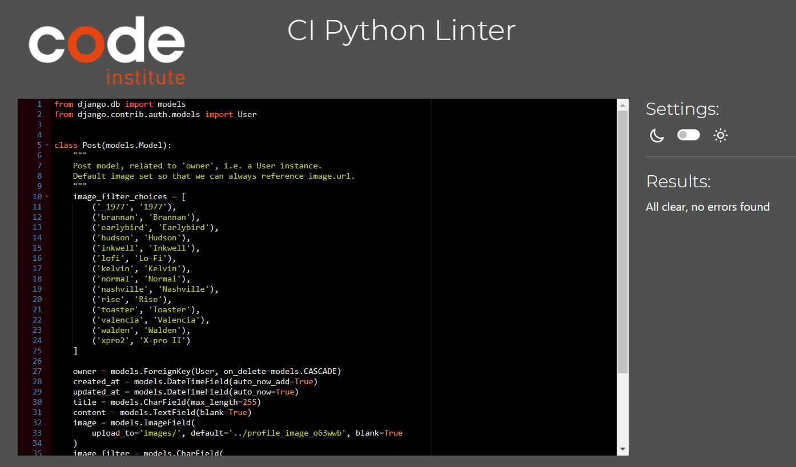

Screenshot of posts serializers.py

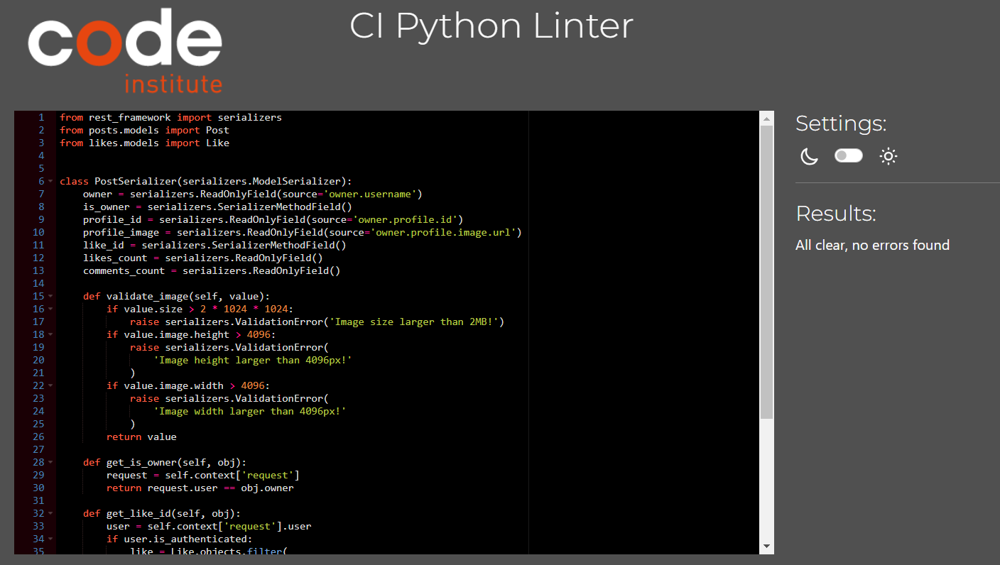

Screenshot of posts views.py

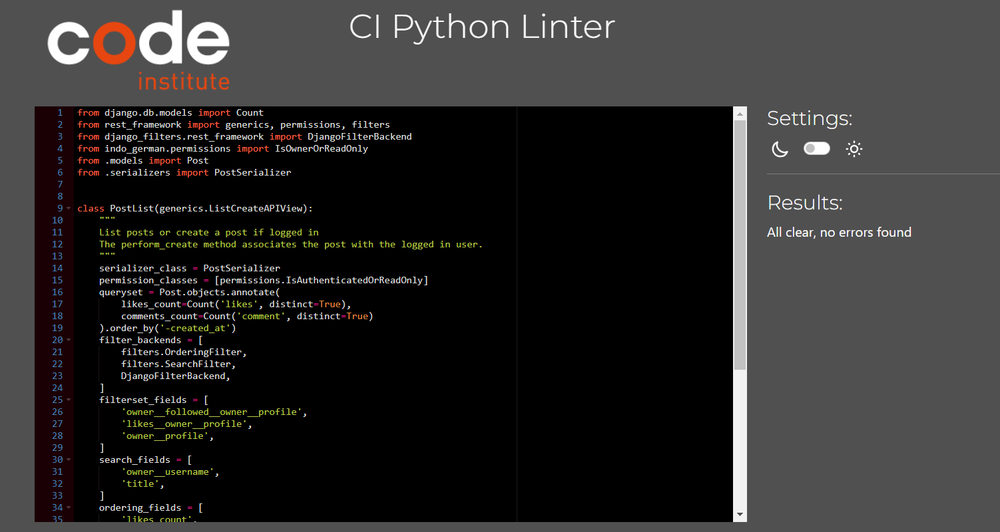

Screenshot of postlikes models.py

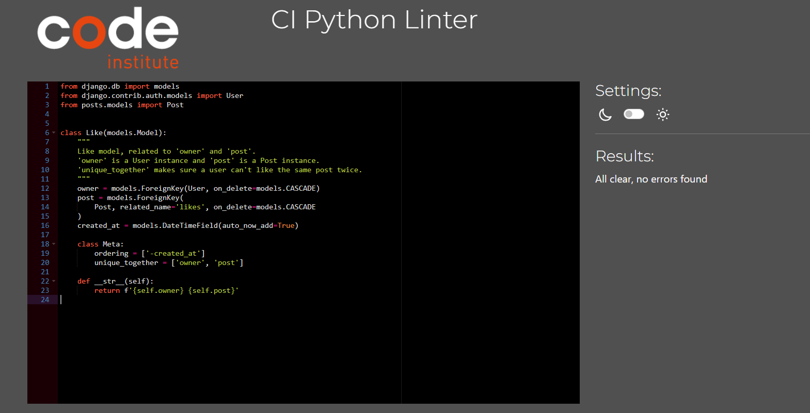

Screenshot of postlikes serializers.py

Screenshot of postlikes views.py

Screenshot of commentlikes models.py

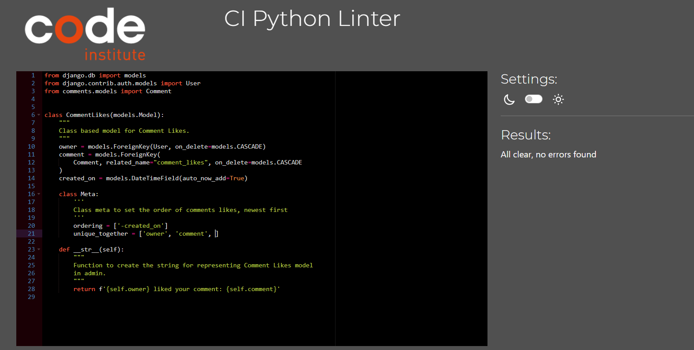

Screenshot of commentlikes serializers.py

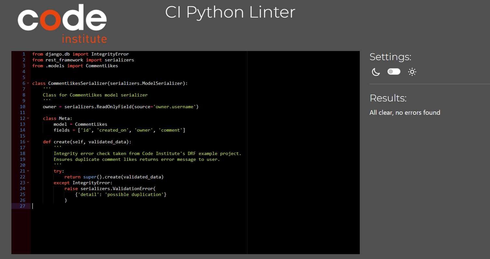

Screenshot of commentlikes views.py

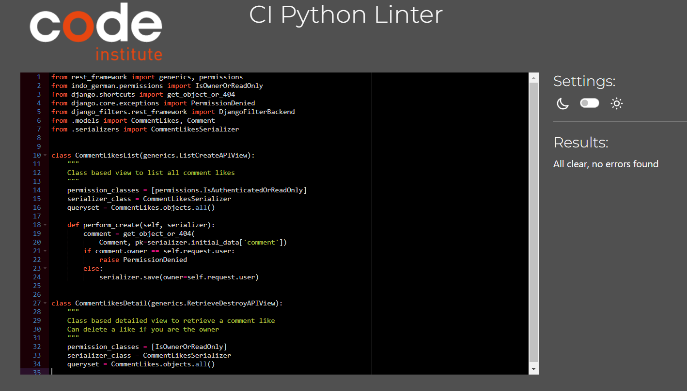

Screenshot of comments models.py

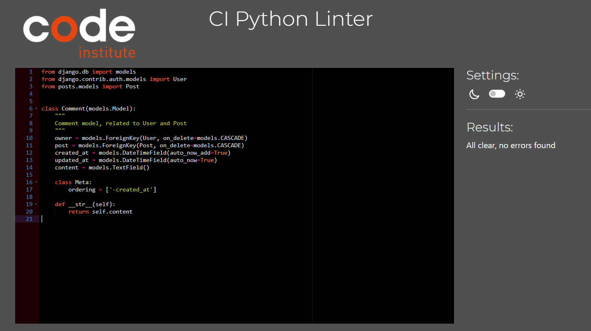

Screenshot of comments serializers.py

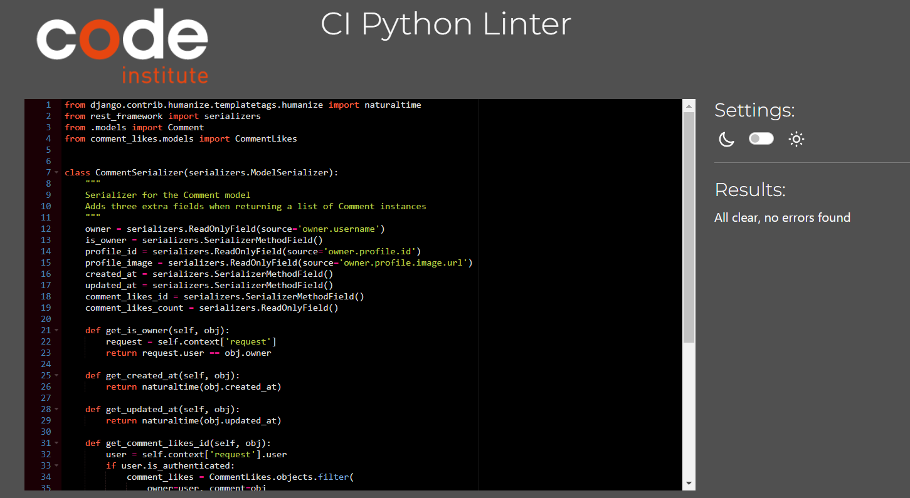

Screenshot of comments views.py

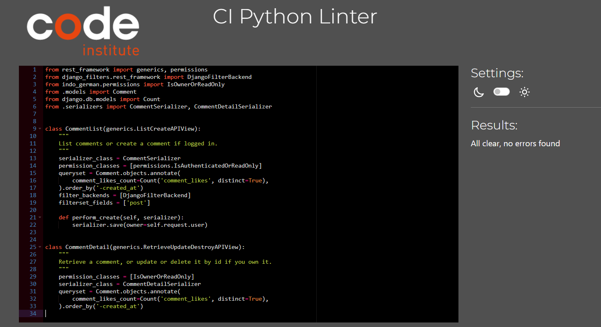

Screenshot of followers models.py

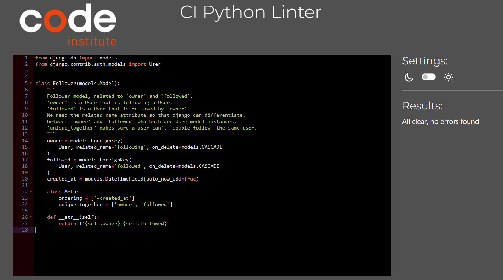

Screenshot of followers serializers.py

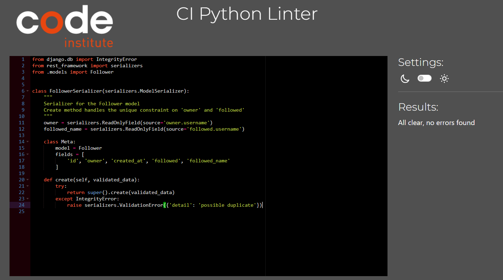

Screenshot of followers views.py

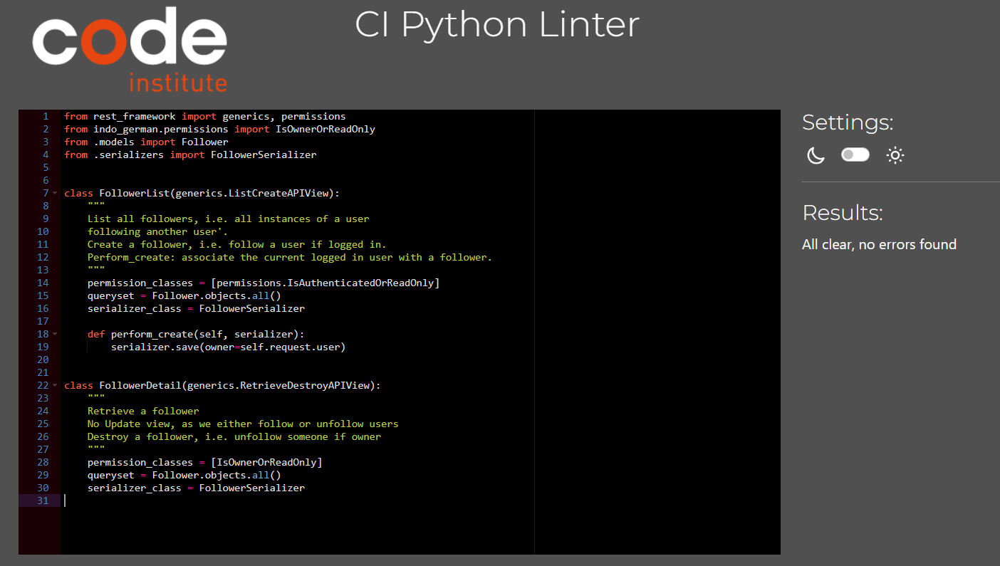

Screenshot of profiles models.py

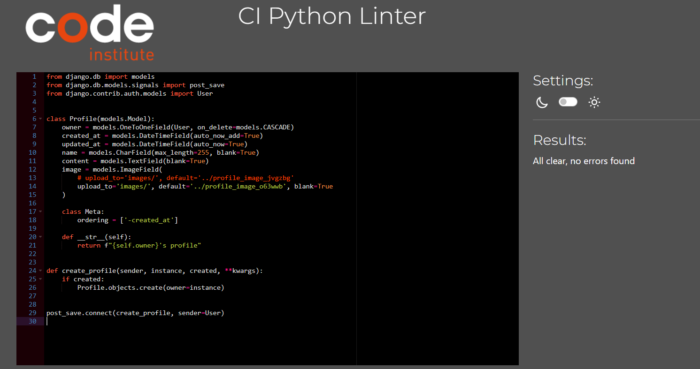

Screenshot of profiles serializers.py

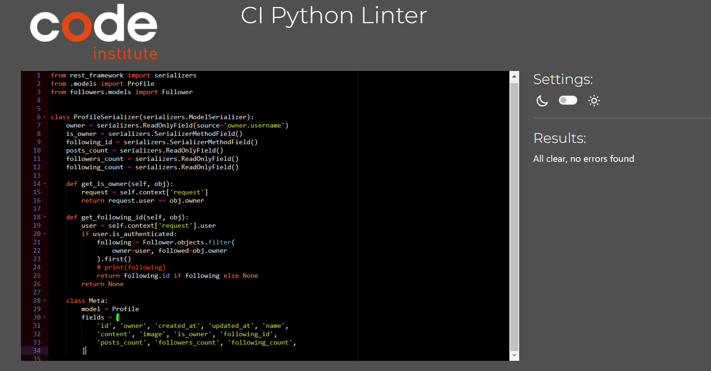

Screenshot of profiles views.py

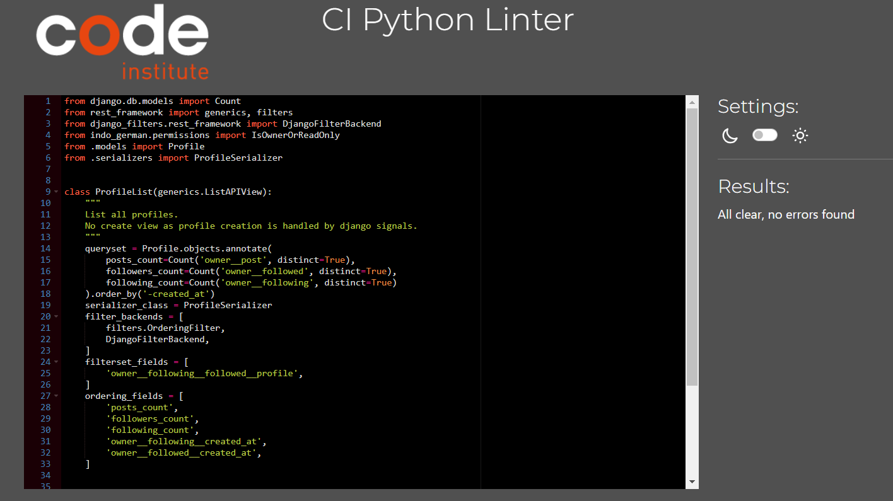

## Validation - Frontend

- Following files have been run through CI Python Linter and all files returned no issues.

Screenshot of posts models.py

Screenshot of posts serializers.py

Screenshot of posts views.py

Screenshot of postlikes models.py

Screenshot of postlikes serializers.py

Screenshot of postlikes views.py

Screenshot of commentlikes models.py

Screenshot of commentlikes serializers.py

Screenshot of commentlikes views.py

Screenshot of comments models.py

Screenshot of comments serializers.py

Screenshot of comments views.py

Screenshot of followers models.py

Screenshot of followers serializers.py

Screenshot of followers views.py

Screenshot of profiles models.py

Screenshot of profiles serializers.py

Screenshot of profiles views.py

### W3C Validator 

The [W3C Markup Validation Service](https://validator.w3.org/) was used to validate the HTML of the website. No errors were identified. 
Result is as shown here.

### W3C Jigsaw Validator 

The official W3C Markup Validator was used to validate the CSS in the project.

[W3C CSS Jigsaw Validatior](https://jigsaw.w3.org/css-validator/validator)

All CSS code passed through the validator without any issues.

### JSX Validation using ESLint

- ESlint was downloaded following the instructions [here](https://gist.github.com/ianmeigh/8e603b91a38d7829d959402bfcf29d3d), credit goes to Ian Meigh. Following error were shown while running. 

1. Error: Do not pass children as props compile error for Infinite Scroll component: This was solved by removing children element and place code in tags. Detailed screenshot in Issue and Fix section in README.md.

2. Error in DropdownMenu.js - component-definition-is-missing-display-name 
	- Credit: [Quora](https://www.quora.com/Why-is-component-definition-missing-display-name-react-display-name-error-occur-JavaScript-HTML-arrays-reactjs-antd-development)
	- Reason: ESLint thinks you are defining a new component without setting any name to it.

	This is explained because ESLint cannot recognise the render prop pattern because you are not directly writing this render prop into a component, but into an object.

	You can either put the render prop directly into your jsx implementation of the component, or shut down the ESLint's error by doing this :

	// eslint-disable-next-line react/display-name

	OR

	If anyone needs to avoid this in all the files, add below to the rules section of .eslintrc.js file,

	{ 
	... 
	"rules": { 
		"react/display-name": "off" 
	} 
	} 

I used last one. Add "react/display-name": "off" in .eslintrc.json file.

## Performance

  - Dev tool lighthouse test for Desktop

  

  - Dev tool lighthouse test for Mobile

  
